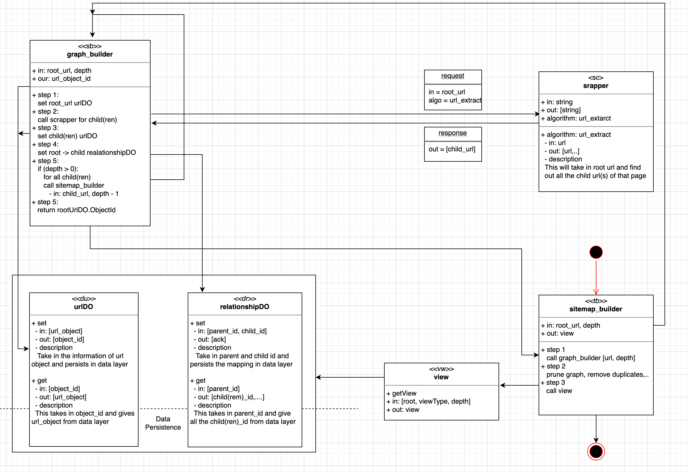

### design

### components

1. sitemap_builder
    
    Orchestrator which calls underlying service to build and return the sitemap json view.

1. graph_builder

    This build the dependency graph for the sitemap. Each Url is considered as a node.
Functionalies can be broken down into
    1. create rootUrl node and persist node
    1. calls scrapper to get children url
    1. create relation b/w root and children and persist relation
    1. recursively calls itself to create children
    1. returns rootUrl object

1. scrapper

    Takes in url, gets all children url, performs some validations and return children urls.
It has following implementations
    1. pageUrlExtract: crawls www
    1. mockPageUrlExtract: mock interface returns without scrapping

1. urlDO, relationDO

    Get, Set over mysql

1. view
    
    Level traversal of graph, uses channel as a queue and go routine for db call concurrency
    
### Scaling-up

#### Scrapper

Calls http-get(i/o) and tokenize(compute) the html document. 

1. async scrapper calls, task scheduling model; maintain operations
1. distribute scrapper calls as a service, scale horizontally (costly)

#### graph.Build()

This is called recursively and does not return anything. Builds the graph in level-order fashion

1. expose graph.Build() as a service and scale horizontally

